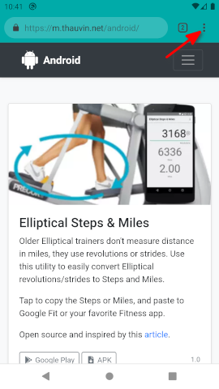
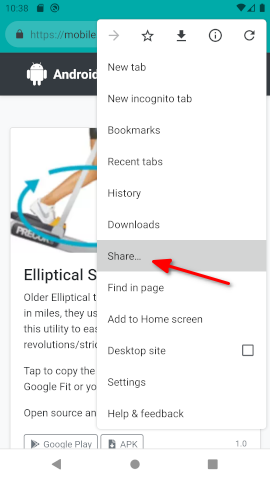
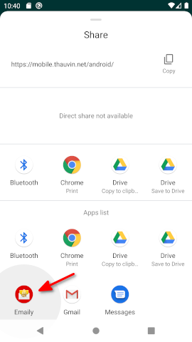
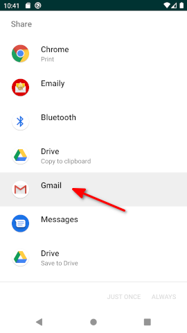
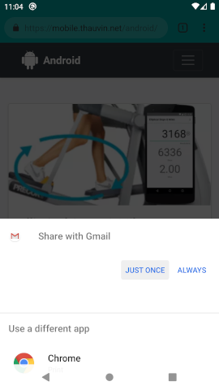
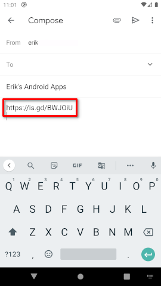
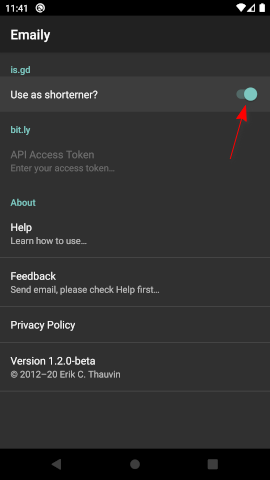
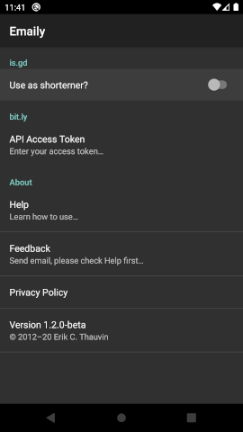
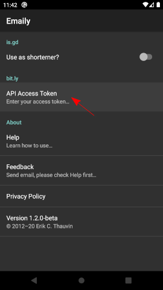

# Emaily for Android

Emaily makes it easy to share shortened links directly from your phone's options menu. 

No copy/paste required. Long URLs are squeezed into fewer characters using the [is.gd](https://is.gd/) or [bit.ly](https://bit.ly) services.

> "_A simple app that makes things easier, and helps us to save some time._" — AndroidZoom

## How to use...

When you find a page you want to share, simply follow these steps:

1. Select the **Options** menu:

    

2. Select the **Share...** menu:

    

3. Select **Emaily** from the **Share** sheet:

    

4. Select **Gmail** (or whichever application you want to share with):

     

5. Compose & Send Email

    

## Using Bitly...

In order to use Bitly as for shortening links, you will need a [Bitly API Access Token](https://bitly.is/accesstoken).

To enable Bitly follow these steps:

1. Disable **is.gd** turning its switch off:

     

2. Click on the Bitly **API Access Token** preference option:

    

3. Enter your Bitly **API Access Token**, and click **OK**:

    
